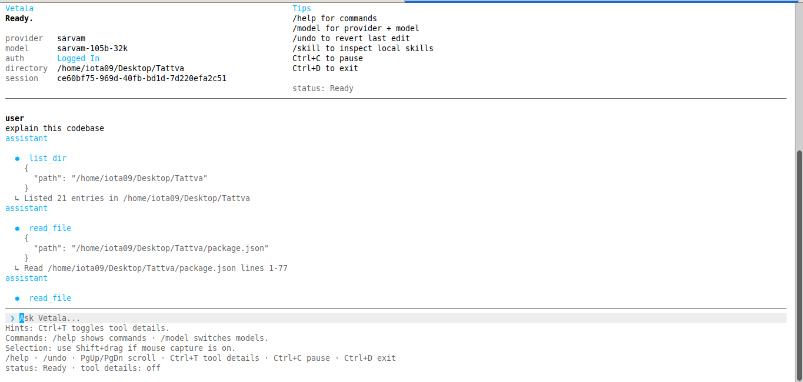

# Vetala

Vetala is a terminal-first coding assistant with an interactive TUI, local tools, approval gates, session memory, and a skill system for reusable workflows.

This is the first build and not a stable v1 release, so some bugs are expected.



## Overview

Vetala is designed for code-focused terminal work:

- interactive CLI built with Ink
- multi-turn sessions with persisted state
- local file, shell, git, and web-capable tool execution
- approval-aware operations for safer workspace access
- local `skill/` runtime for reusable instructions and references
- prompt compaction to preserve continuity across longer sessions
- provider-aware model selection with Sarvam and OpenRouter profiles
- provider-first `/model` flow with OpenRouter model-id entry
- diff previews for file edits and `/undo` for the last tracked change
- queued or force-sent follow-up prompts while the current turn is still running
- startup update notifier powered by `update-notifier` with “update now” or “update later”
- built-in HTML search providers with DuckDuckGo by default and Stack Overflow for coding lookups

Current provider support includes Sarvam AI and OpenRouter.

## Patch Notes

### v0.2.2-dev

- improved `write_file` and patching tool output to concisely summarize line changes instead of printing full file contents
- fixed infinite looping of agents on repeated tool calls by properly clearing loop-prevention caches after mutating actions
- fixed agent loop-prevention strictness for stringified JSON comparisons
- fixed "Allow for Session" API keys accidentally dropping when the CLI config was hot-reloaded
- added a custom braille animated terminal spinner for a smoother visual experience
- increased the agent tool execution limit from 8 to 20 turns to support more complex reasoning workflows

### v0.2.1-dev

- switched the startup updater to `update-notifier` while keeping Vetala's own in-app `update now` or `update later` prompt
- added cached foreground update checks plus snooze handling so a fresh npm release can surface cleanly in the TUI

### v0.2.0-dev

- added provider-aware `/model` setup with Sarvam model selection and manual OpenRouter model-id entry
- added OpenRouter as the second supported provider
- added HTML web search with DuckDuckGo by default plus Stack Overflow, Brave, and Bing provider options
- added prompt guidance so Vetala searches instead of guessing when it is unsure about factual or current information
- added diff previews before file changes and `/undo` for the last tracked edit
- improved streaming performance and approval handling so long replies are less likely to stall the TUI
- added runtime environment detection for host OS, shell, terminal type, and viewport so the UI and agent can adapt to the current machine
- added `sleep` plus longer shell timeouts so the agent can wait for slower builds, tests, or generated output
- added an interactive next-prompt popup so you can queue a message or stop the current turn and send the next one immediately

## Compatibility

Vetala is currently tested on Linux.

Windows and macOS have not been validated yet.

## Installation

### Global install

```bash
npm install -g @vetala/vetala
vetala
```

### Local development install

```bash
npm install
npm link
vetala
```

The package is published as `@vetala/vetala` and exposes a global `vetala` binary through `package.json`.

## Getting Started

Run Vetala in a project directory:

```bash
vetala
```

Or run from source during development:

```bash
npm run dev
```

On startup, Vetala opens an interactive terminal UI and asks you to confirm trust for the current workspace before enabling tool access.
It also detects the current host platform, shell, and terminal profile and exposes that context in the UI and agent runtime.

## Configuration

Model selection and credential setup are available from inside the TUI through:

```text
/model
```

The default web search provider is DuckDuckGo HTML. For programming-specific web lookups, Vetala also exposes `stack_overflow_search`.

Configuration and session data are stored in the user application directory for the current platform.
`/config` also prints the `host:` and `term:` lines used in issue reports.

## Core Commands

- `/help` shows available commands
- `/model` updates model and auth settings
- `/skill` lists and manages local skills
- `/tools` shows available tools
- `/history` shows recent session messages
- `/resume <session-id>` reopens a saved session
- `/new` starts a fresh session
- `/undo` reverts the last tracked file edit in the current session
- `/approve` shows active approvals
- `/config` prints runtime configuration
- `/logout` clears locally saved auth state
- `/clear` clears the visible transcript
- `/exit` exits the application

## Skills

Vetala loads local skills from:

```text
skill/<name>/SKILL.md
```

Skills are indexed locally and exposed through the `skill` tool so the assistant can:

- list available skills
- load a skill overview
- read referenced files inside a skill
- pin and unpin skills across turns

This keeps the default prompt smaller while still allowing deeper workflow guidance when needed.

## Development

```bash
npm run check
npm test
npm run build
```

## Contributing

See [CONTRIBUTING.md](./CONTRIBUTING.md).

## License

Licensed under Apache-2.0. See [LICENSE](./LICENSE).

Modified third-party material is documented in [THIRD_PARTY_LICENSES.md](./THIRD_PARTY_LICENSES.md).
